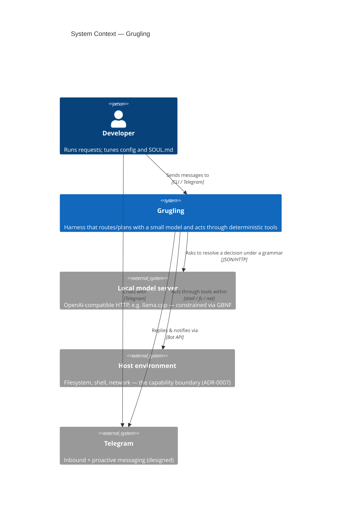
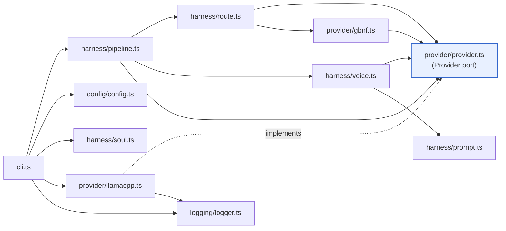
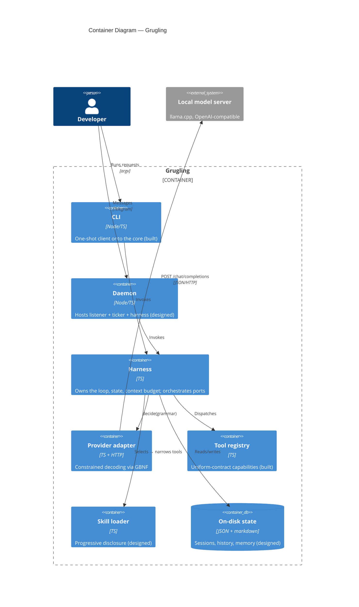
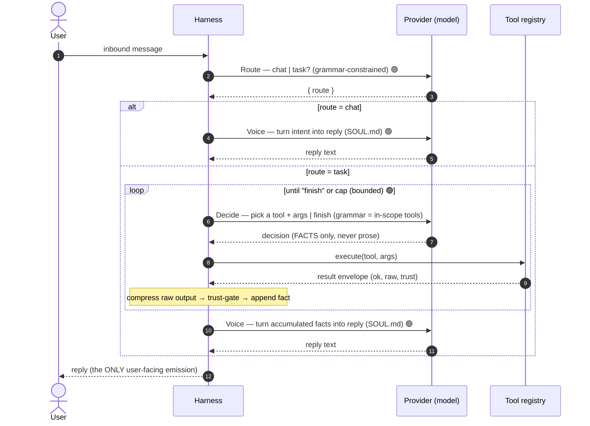
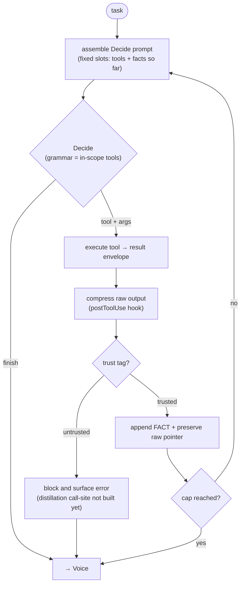
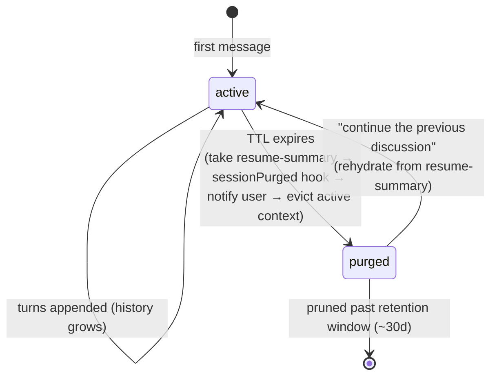

# Grugling — Code Design

A developer's guide to how grugling is built: the **code structure**, the **call
pipeline and its extension points**, and the **lifecycles** that tie them
together.

This document is the *code-level* companion to the existing docs. Where they
already say it well, this links rather than repeats:

- [CONTEXT.md](../../CONTEXT.md) — the vocabulary. Every capitalised domain term
  here (Harness, Provider, Decide, Voice, Skill, Hook, Session…) is defined
  there. This document assumes it.
- [ARCHITECTURE.md](../../ARCHITECTURE.md) — the whole-system picture and MVP scope.
- [docs/adr/](../adr/) — *why* each load-bearing decision was made.
- [docs/prd/core-router-mvp.md](../prd/core-router-mvp.md) — the contract for the
  current build.

## How to read the status tags

Grugling is being built riskiest-thing-first, so some of the design still
exists on paper before it exists in `src/`. Every structural claim below is
tagged:

- 🟢 **Built** — code exists in `src/` today (build-order steps 1–3).
- 🟡 **Designed** — specified in the ADRs/PRD/ARCHITECTURE, not yet coded.

The honest summary: **the Provider seam, the full CLI message path
(Route → chat | task, then Voice), deterministic compression, the bounded
Decision loop, and the tool registry with one trusted read-only `now` tool are
built; skill loading/progressive disclosure, untrusted-content distillation, the
remaining ports, and all persistence are designed.** Steps 1–3 prove the three
riskiest bets already landed on `main` — that a tiny local model returns a
schema-conformant decision, that chat round-trips through a terse persona reply,
and that a small task can complete through a constrained tool loop.

---

## 1. The core idea, in one diagram

Grugling treats a *small* local model as a **router/planner, never the worker**.
The model is called only to resolve small, schema-constrained decisions; the
deterministic Harness and its Tools do the work.



The single most important property: **the model sits behind one port and is only
ever asked for a decision shaped by a grammar.** Everything else in the design
follows from protecting that property — keeping calls small, keeping the model
away from raw untrusted content and secrets, and keeping the surrounding
machinery deterministic and swappable.

---

## 2. Code structure

### 2.1 What exists today 🟢

A single pnpm package, Node 24 running `.ts` directly (no build step). Modules
under `src/`, grouped by role:

```
src/
├── cli.ts                  🟢 entry point — wires config + provider + soul + logger, runs the pipeline
├── provider/
│   ├── provider.ts         🟢 the Provider PORT  (decide() + generate(); their Args/Result types)
│   ├── llamacpp.ts         🟢 the first ADAPTER  (OpenAI-compatible HTTP → llama.cpp, top-level GBNF)
│   ├── gbnf.ts             🟢 schema → GBNF compiler (closed-enum decisions only, for now)
│   └── *.test.ts           🟢 adapter + compiler tests
├── harness/
│   ├── pipeline.ts         🟢 the per-message pipeline: Route → chat=Voice | task=Decide loop → Voice
│   ├── route.ts            🟢 the Route call-site (chat | task) — constrained decision
│   ├── decide.ts           🟢 the Decide call-site (tool + args | finish) — constrained decision
│   ├── loop.ts             🟢 the bounded Decision loop (facts, raw preservation, fallback/trust boundary)
│   ├── compress.ts         🟢 deterministic tool-output compression
│   ├── voice.ts            🟢 the Voice call-site — free-text persona reply (generate())
│   ├── prompt.ts           🟢 fixed-slot prompt assembly (assembleSystem)
│   ├── soul.ts             🟢 loads the editable SOUL.md persona
│   └── *.test.ts           🟢 drive the pipeline through a scripted fake Provider
├── tools/
│   ├── tool.ts             🟢 uniform Tool contract (`ok/raw/trust`, metadata)
│   ├── registry.ts         🟢 flat registry — adding a tool never edits the Harness
│   ├── now.ts              🟢 the first trusted read-only tool (UTC date/time)
│   └── *.test.ts           🟢 tool + registry tests
├── config/
│   ├── config.ts           🟢 profile loader: defaults < file profile < env
│   └── config.test.ts
└── logging/
    └── logger.ts           🟢 structured JSONL logging hook (stderr sink)
```

(`SOUL.md` and `config.example.yaml` live at the repo root — the editable persona
and the config template.)

The dependency direction is strict and one-way — the arrow points *toward* the
port, never toward an adapter:



Note what the Harness (`pipeline.ts`, `route.ts`, `voice.ts`) depends on: the
**port** (`provider.ts`), the **compiler** (`gbnf.ts`), and the **prompt
assembler** (`prompt.ts`). It never imports `llamacpp.ts`. Only the composition
root (`cli.ts`) knows which adapter is real — and binds the soul, logger, and
config into it. That is the whole ports-and-adapters discipline (ADR-0001), and
it is load-bearing across the built steps on `main`.

### 2.2 Where it grows 🟡

The PRD names the module layout the build grows into. New directories appear
under `src/`, each behind the same kind of port or registry, so adding one never
edits the Harness:

```
src/
├── harness/                🟢 (later: more call-sites beyond the built Route/Decide/Voice path)
├── provider/               🟢 (richer gbnf: tool-input schemas, not just enums)
├── tools/                  🟢 (later: more tools beyond the built `now` tool)
├── skills/                 🟡 skill loader + progressive-disclosure index
├── memory/                 🟡 Memory port + grep/markdown adapter (core / recall)
├── sessions/               🟡 session store, conversation history, compaction
├── messaging/              🟡 Messaging port + Telegram adapter
├── scheduler/              🟡 internal ticker + user jobs
├── hooks/                  🟡 lifecycle hook registry + redaction
├── config/                 🟢
└── logging/                🟢
```

### 2.3 The deep-module lens

Applying the [codebase-design](../../.agents/skills/codebase-design/SKILL.md)
vocabulary — *deep module* = a lot of behaviour behind a small interface, sitting
at a clean seam. Grugling's existing modules score well on this, which is why the
skeleton is small but already the right shape.

| Module | Interface (what a caller must know) | Hidden behind it | Depth |
|---|---|---|---|
| **Provider** `provider.ts` 🟢 | Two verbs: `decide(args)` (constrained decision) and `generate(args)` (free-text reply). Inputs are *per-call* (`user`, `grammar` or `temperature`, `system?`); `baseUrl`/`model`/`reasoning` bind at construction. | HTTP transport, timeout/abort, the GBNF constraint mechanism, the fallback ladder, JSON repair, reasoning-disable, truncation detection, metrics logging. | **Deep.** A caller learns two verbs and gets reliable structured decisions *and* persona replies. |
| **schema→GBNF compiler** `gbnf.ts` 🟢 | `enumDecisionSchema(...)` + `compileToGbnf(schema) → string`. | GBNF rule-name rules (the `_`-invalidates-the-grammar trap), JSON-literal escaping, root-rule assembly. | **Deep.** Callers describe a decision shape; grammar generation is none of their business. |
| **Pipeline** `pipeline.ts` 🟢 | `handleMessage(provider, message, opts) → result`. | Route→branch orchestration, task-loop wiring, Voice handoff, and error surfacing (route/loop/voice failures never become silent chat). | **Deep.** One entry point hides the whole per-message flow; the CLI and (future) daemon share it. |
| **Voice** `voice.ts` 🟢 | `voice(provider, {soul, message, maxTokens, temperature})`. | Fixed-slot assembly of the persona + per-call-site fragment; the free-text `generate` call. | **Deep-ish.** The persona call-site behind one function; SOUL handling is its business, not the pipeline's. |
| **Prompt assembly** `prompt.ts` 🟢 | `assembleSystem(...slots) → string`. | Fixed-order joining, empty-slot dropping, trimming — the "no growing transcript" discipline (ADR-0006). | Shallow-but-correct: a deliberate single choke point so every call-site assembles prompts the same way. |
| **Config** `config.ts` 🟢 | `loadConfig() → ResolvedConfig`; pure `resolveConfig(file, env)` underneath. | Precedence (defaults < profile < env), YAML parse, missing-file tolerance, env coercion/validation (numbers *and* booleans). | **Deep**, and split at an IO seam: the precedence logic is pure and trivially testable. |
| **Soul** `soul.ts` 🟢 | `loadSoul() → string`. | The single `SOUL.md` location; a loud error when absent (no silent empty persona). | Shallow-but-correct: the one place the persona file is read. |
| **Logger** `logger.ts` 🟢 | `log(level, event)` + `isEnabled(level)` + `debug/info/warn/error` wrappers, over a pluggable `LogSink`. | Severity levels, the minimum-level filter, JSONL serialisation + the `level` field, stderr-vs-injected sink (keeps stdout clean for the CLI result). | **Deep-ish.** A small leveled interface over a swappable sink — the seam for a structured-log backend and the redaction hook (ADR-0010); also the first **Hook**. |

**Seam discipline** (one adapter = hypothetical seam; two = real):

- The **Provider port is a *real* seam.** It has two adapters today — the
  `llamacpp` HTTP adapter (production) and the **scripted fake Provider** the
  Harness tests inject ([route.test.ts](../../src/harness/route.test.ts)). The
  fake makes the entire pipeline deterministic without touching the model. This
  is the *primary test seam* the PRD mandates for all later harness work.
- The **`fetchImpl` parameter** in the llama.cpp adapter is an *internal* seam —
  private to the adapter, used only by its own tests. It is correctly **not**
  exposed through the Provider interface.
- The **Logger** is a seam with a pluggable `LogSink` port (default JSONL-to-stderr) — the choke point a future redaction hook will sit behind (ADR-0010); the sink's `write` is also injectable for tests.

The **deletion test** confirms the shapes earn their keep: delete the Provider
port and every call-site would hand-roll HTTP, timeouts, grammar wiring, and the
fallback ladder; delete the compiler and every call-site would hand-write — and
mis-escape — GBNF. Complexity reappears across N callers, so the modules pay
back.

---

## 3. The call pipeline and its extension points

This is the heart of the system: how a message flows through the Harness, and the
named places where behaviour attaches without editing the core.

### 3.1 Containers



The CLI and the (designed) daemon are two clients onto **the same Harness core**.
The CLI is standalone today; the daemon hosting is out of scope for the current
build but the seam is the same `route()`/harness entry, so the split costs
nothing structurally.

### 3.2 The per-message pipeline (lifecycle of one request) 🟢

Two regimes meet in one flow (ADR-0003): a stateful **conversation** (persona,
history) wraps a stateless **decision loop** (tools, no history). The model is
hit at distinct **call-sites**, each a freshly assembled prompt + a grammar its
output must satisfy. There is no growing transcript fed to the model.



Three invariants make this work and are worth internalising:

1. **Decide produces facts; Voice produces the reply.** The loop never addresses
   the user; the persona never formats a tool call. (ADR-0003)
2. **Voice is the only emitter** of user-facing text, including proactive
   notifications — so the Messaging port must support *initiating* messages, not
   just replying.
3. **No global system prompt** (ADR-0006). Output *format* is guaranteed by the
   grammar, so "emit valid JSON" instructions are redundant. `SOUL.md` is
   injected **only at Voice**; every other call-site uses a minimal per-call-site
   fragment ([`ROUTE_SYSTEM`](../../src/harness/route.ts) is the built example).

### 3.3 Call-sites (the model's only entry points)

A call-site is a place the Harness invokes the model: a freshly assembled prompt
+ a schema (ADR-0002). The decision contract is a small, closed set:

| Call-site | Decision | Output | Grammar source | Status |
|---|---|---|---|---|
| **Route** | chat or task? | `{ route }` | fixed enum | 🟢 |
| **Decide** | call a tool (with args) or finish | tool name + args, or `finish` | the **currently in-scope tool input schemas** | 🟢 |
| **Voice** | free-text reply | prose | unconstrained (the one free-text site) | 🟢 |
| **Summarise / extract** | distil untrusted content to facts | facts | the **tool-less** trust-boundary site (§3.6) | 🟡 |
| **Compact** | shrink running conversation | summary | conversation regime only | 🟡 |

There are **two kinds** of call-site, and the Provider port has a verb for each:

- **Constrained decisions** (Route, Decide, summarise, compact) — define a
  schema, compile it to a grammar, call `provider.decide`. Output is parsed and
  conformance-checked. [`route.ts`](../../src/harness/route.ts) is the reference —
  ~30 lines.
- **Free-text Voice** — the deliberate exception (no schema, no grammar): call
  `provider.generate`. [`voice.ts`](../../src/harness/voice.ts) is the reference.
  It is the *only* unconstrained call-site, which is exactly why it is also the
  only place the SOUL persona is injected.

### 3.4 Ports (the swappable seams) 🟡 (Provider 🟢)

The Harness is a small stable core orchestrating ports. **Correctness never
depends on an optional adapter — there is always a dumb fallback** (ADR-0001).

| Port | What the Harness needs | MVP adapter | Later | Status |
|---|---|---|---|---|
| **Provider** | "return a decision matching this grammar" *and* "return a free-text reply" | OpenAI-compatible HTTP + GBNF, with model-side reasoning disabled by default | other backends | 🟢 |
| **Memory** | "facts relevant to this context" (`core()` + `recall(query)`) | grep over markdown + index | SQL / vectors / semantic | 🟡 |
| **Compression** | shrink *one tool's* output before context | deterministic (head/tail/grep/cap) | RTK, model-based | 🟢 |
| **Compaction** | shrink the *running conversation* near budget | model-summarise; truncate fallback | smarter strategies | 🟡 |
| **Messaging** | reply *and* initiate to the user | Telegram | other channels | 🟡 |

A port is defined by what the Harness *needs*, never by how its first adapter
happens to work — e.g. `recall` returns "facts relevant to this context", not
"substring matches". A leaked implementation detail would break the swap.

### 3.5 Tools and Skills (how capabilities are added) 🟢 tools / 🟡 skills

This is the contributor's extension surface — **capabilities grow by drop-in,
never by editing the Harness**.

**Tool** — a single deterministic capability with a uniform contract:

```ts
// current shape (`src/tools/tool.ts`)
interface Tool {
  name: string;
  description: string;
  inputSchema: EnumDecisionSchema;           // → fed to the schema→GBNF compiler
  execute(args): ResultEnvelope;             // deterministic
  meta: {
    trust: "trusted" | "untrusted";          // gates the trust boundary (§3.6)
    risk: "low" | "medium" | "high";
    needsConfirmation?: boolean;             // declared, not implemented in MVP
    longRunning?: boolean;                   // declared, not implemented in MVP
  };
}

interface ResultEnvelope {
  ok: boolean;                               // tool succeeded / exited cleanly
  raw: string;                               // full output preserved OUTSIDE context
  trust: "trusted" | "untrusted";
}
```

The crucial coupling: **the in-scope tools' `inputSchema`s are what generate the
Decide grammar.** Adding a tool needs no separate grammar work — the schema *is*
the grammar source. This is why `gbnf.ts` is built first and grows from
closed-enums toward full tool-input schemas.

The bounded Decision loop derives the model-facing `summary` and the
out-of-context `rawPointer` from that envelope, rather than requiring each tool
to build those fields itself.

**Skill** — a bundle of instructions + a *narrowed* tool set + optional scripts,
with **progressive disclosure** (ADR-0004): only skill names + one-line
descriptions sit in context; a skill's detail and tools load only when selected.
This does double duty —

- It keeps context tiny under a host-variable budget.
- It *improves reliability*: a selected skill narrows in-scope tools → a smaller
  Decide grammar → fewer choices → a small model that is actually accurate.

What is built today is the flat tool registry plus one trusted read-only tool:
[`now.ts`](../../src/tools/now.ts). The skill loader, progressive disclosure,
and the planned `summarise-link` / `system-health` skills are still designed.

### 3.6 Hooks (lifecycle extension points) 🟡 (logging 🟢)

A **Hook** is a named point in the Harness lifecycle where cross-cutting
behaviour attaches without modifying the core. The logging hook is built today
([logger.ts](../../src/logging/logger.ts) plus the loop/pipeline call-sites that
emit tool/fallback/trust-boundary events); the rest are designed:

| Hook | Fires when | Used for | Status |
|---|---|---|---|
| **logging** | every model call, plus tool/fallback/trust-boundary events | structured JSONL; headline = constraint-conformance rate. Each event also carries `ms`, `finishReason`, prompt/completion/cached tokens, and tokens/sec — latency + context-budget pressure (user stories 19–21) | 🟢 |
| **redaction** | content enters context *or* logs | scrub secrets — one choke point for both (ADR-0008) | 🟡 |
| **postToolUse** | after a tool runs | compression, instrumentation | 🟡 |
| **contextPressure** | running context nears the budget | trigger Compaction | 🟡 |
| **taskComplete** | a decision loop finishes | metrics, follow-ups | 🟡 |
| **sessionPurged** | a session TTL expires | summarise → notify → evict | 🟡 |

### 3.7 Two boundaries the pipeline enforces

These are not optional policies — they are structural, enforced by the Harness
off declarative tags (ADR-0005, 0008):

- **Trust boundary.** A tool result carries a `trust` tag. **Raw untrusted
  content may only reach a call-site with no actuating tools in scope**. The
  target step-4 shape distils it into plain facts by a tool-less
  summarise/extract step before any Decide call-site can act on it. Current code
  does not have that distillation call-site yet, so it **fails closed** and
  blocks the task instead. Either way, a poisoned web page cannot become an
  executed action.
- **Secrets boundary.** The model never sees raw secrets. Tools *wield* them by
  handle (the harness substitutes the real value only at execution time), and the
  redaction hook scrubs context *and* logs. Broad capability to *act* never
  requires the model to *see* credentials.

---

## 4. Lifecycles

Four nested lifecycles, from longest-lived to shortest.

### 4.1 Process lifecycle

- **CLI 🟢** — one-shot. `cli.ts`: parse argv → `loadConfig()` + `loadSoul()` →
  construct `Provider` (bind baseUrl/model/logger/reasoning) → `handleMessage` →
  print the reply to stdout, structured events to stderr → exit code. No
  persistence, no loop.
- **Daemon 🟡** — long-lived. Boots, loads config, starts the messaging listener
  + internal ticker + harness, then serves. **All state lives on disk, so
  restarts resume cleanly.** Process supervision / auto-recovery is explicitly
  *external* to the daemon (post-MVP).

### 4.2 Request lifecycle

One inbound message → the pipeline in §3.2 → one reply. Cost: a chat is **2**
model calls (Route, Voice) — **built** 🟢; a task is **Route + Decide×N + Voice**
— **built** 🟢, currently over a flat registry with one trusted tool and no
skill narrowing yet. Accepted trade-off (ADR-0003): each call is small, constrained,
and reliable, which matters more than round-trips on local inference. (Spike:
~0.8–1.3 s/call; observed on the reference box with reasoning **off**, Route
~1–2.7 s and Voice ~1 s — with model-side reasoning *on*, a single call ran ~10 s
and silently overran the reply budget, which is why reasoning is disabled by
default — ADR-0009.)

### 4.3 Decision-loop iteration 🟢

The bounded, stateless loop inside a task. It holds no conversation — each
iteration is one constrained decision followed by one deterministic action:



Two safety properties live here: the **cap** (a confused model cannot loop
forever or burn the machine — configurable) and the **fallback ladder** at the
Decide call (next section).

### 4.4 Constrained-decision lifecycle (the fallback ladder) 🟢 partial

Every decision call goes through the ladder (ADR-0002). The Provider implements
the first two rungs in [llamacpp.ts](../../src/provider/llamacpp.ts), and the
task loop wires the third rung for Decide:

1. **Constrain** — the GBNF grammar shapes the output. 🟢
2. **Parse-and-repair** — `tryParse()` leniently pulls the first `{…}` out if the
   response is wrapped. 🟢
3. **Treat-as-answer** — last resort, **logged as a failure, never silent**. 🟢 for Decide-in-task; other decision call-sites still surface failure instead of replying.

The result is reported honestly: `ok` (transport succeeded) and `conformant` (got
grammar-shaped output) are *separate* flags. A non-conformant result is surfaced
(`ok && !conformant`), never quietly turned into a chat reply. The headline
metric across runs is the **constraint-conformance rate** — did the model's
output match the grammar first try?

The **free-text Voice path** (`generate`) has no grammar and no conformance, but
reports just as honestly 🟢: a reply truncated at the token budget
(`finish_reason: "length"`) or an empty completion comes back as `ok: false` with
a clear error — never a silent partial or blank `grug:` line. The most common
cause of an empty completion is a **reasoning** model spending the whole output
budget on a hidden chain-of-thought before emitting the reply; grugling disables
model-side reasoning by default to prevent it (ADR-0009), and the structured log
records `finishReason` + token counts so the failure is diagnosable.

### 4.5 Session lifecycle 🟡

A **Session** is a TTL'd conversation thread (one JSON file per session,
`<channel>-<startedAt>`), driven by `status`. The internal ticker manages it:



Key distinctions: **purge ≠ delete** (a purged session can be rehydrated from its
resume-summary); **conversation history is immutable** (compaction derives a
`running summary + recent tail` *view*, it never mutates the record); and history
is *ephemeral* and scoped to the session, while **Memory** (durable agent facts)
is a separate concern that survives purge.

### 4.6 Config resolution lifecycle 🟢

`loadConfig()` → read `config.yaml` (tolerating ENOENT) → `resolveConfig(file,
env)` applies strict precedence: **built-in defaults < selected profile in file <
env vars**. Resolution is a pure function (IO-free), so the precedence logic is
tested without touching the filesystem. A box is re-pointed at a different model
by env var alone — no file edit, no code change.

Profile fields are sized to the host (the dominant constraint is the context
budget): `baseUrl`, `model`, `decisionMaxTokens` (tiny — Route/Decide),
`voiceMaxTokens` (a free-text reply needs more room), `voiceTemperature` (0 =
deterministic; the persona is the one site where >0 may help), `reasoning`
(model-side thinking, default **false** — ADR-0009), `contextBudget`, and
`loopCap` (max Decide iterations per task). Token budgets, loop cap, and
temperature are deliberately *not* constants in code: a 1B model on a Pi and a
200B model on a workstation want very different values (user story 18). Env
coercion validates both numbers and booleans, failing loudly on garbage.

---

## 5. Design principles (the rules that keep it coherent)

These are the invariants a contributor must not violate. Each traces to an ADR.

1. **Ports defined by need, not by adapter** (ADR-0001). If an interface leaks how
   its first adapter works, the swap is already broken.
2. **Correctness never depends on an optional adapter or hook** (ADR-0001). Every
   extension point has a dumb fallback (truncate when no Compactor; parse-repair
   when constraint fails).
3. **Constrain every decision** (ADR-0002). The model cannot emit a malformed or
   out-of-vocabulary choice. On the target build that means **GBNF specifically**
   — `json_schema`/`json_object` return empty content, so the schema→GBNF
   compiler is essential, not incidental.
4. **Stateless loop, stateful conversation** (ADR-0003). Decide ≠ Voice; facts ≠
   reply. Keep them apart.
5. **Progressive disclosure** (ADR-0004). Names + one-liners in context; detail on
   selection. It is what makes the tool ecosystem scalable *and* the small model
   reliable — not a later optimisation.
6. **No global system prompt** (ADR-0006). The grammar enforces format; persona
   lives only at Voice. Resist the instinct to add a SYSTEM.md — it re-bloats
   every call against the budget.
7. **Autonomy by default; the environment is the capability boundary** (ADR-0007).
   Isolation is a deployment choice (Docker/VM), not an in-app allowlist.
   Skills/tools exist for *reliability*, not containment.
8. **Respect the context budget in every slot.** It is small, host-variable, and
   the dominant constraint of the whole system.
9. **The harness plans; the model does not "think"** (ADR-0009). Model-side
   reasoning is off by default — on a small local model it burns the output
   budget and latency for work the deterministic harness is meant to own. Resist
   re-enabling it globally to "make it smarter."

---

## 6. Status at a glance

Mapped to the [ARCHITECTURE.md](../../ARCHITECTURE.md) build order:

| # | Step | Status |
|---|---|---|
| 1 | Provider adapter + constrained decoding (GBNF) | 🟢 Built |
| 2 | Fixed-slot assembly + Route + Voice | 🟢 Built (chat path; task→Voice lands with the Decide loop) |
| 3 | Tool registry + result envelope + read-only tool + Decide loop | 🟢 Built |
| 4 | Skill loader + progressive disclosure + summarise-link (trust boundary) | 🟡 Designed |
| 5 | Memory port + grep/markdown adapter | 🟡 Designed |
| 6 | Daemon + sessions + conversation store + ticker | 🟡 Designed |
| 7 | Messaging port + Telegram adapter | 🟡 Designed |
| 8 | Scheduler (user jobs) | 🟡 Designed |
| 9 | Hooks wired end-to-end (compression, redaction, logging, instrumentation) | 🟡 Logging built (with token/latency metrics); rest designed |

Steps 1–3 deliberately implement the *riskiest* paths end-to-end — config →
Provider port → GBNF constraint → Route → chat/task → SOUL persona reply →
logged result — so the seams every later step depends on are proven before the
system is built outward.
